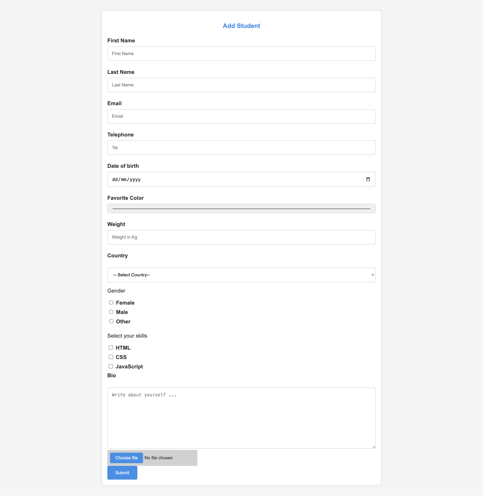

### Day 12 FORMS

1. **Importance of Form**
   - Forms are crucial for capturing user input and interacting with web applications. They enable users to submit data to servers, such as personal details, preferences, and feedback. Forms are essential for creating dynamic, interactive web pages where users can provide input.

2. **Types of Input Fields**
   - Text
   - Password
   - Email
   - Number
   - Date
   - Checkbox
   - Radio
   - File
   - Range
   - Tel
   - URL
   - Search

3. **Attributes of an Input Element**
   - `type`: Specifies the type of input (e.g., text, password).
   - `name`: Defines the name of the input element, which is used to reference form data after submission.
   - `value`: Represents the current value of the input element.
   - `placeholder`: Provides a hint to the user about what to enter in the input field.

4. **Importance of `htmlFor`**
   - The `htmlFor` attribute in `<label>` elements connects the label to a specific input element, improving accessibility. It allows screen readers to read the label text when the associated input is focused, and clicking on the label will focus the input.

5. **Input Type Not Given in Example**
   - `range`: Provides a slider control for selecting a value within a range.

6. **Controlled Input**
   - A controlled input is an input element whose value is controlled by React state. It is bound to a state variable, and its value is updated based on user interactions and state changes.

7. **Requirements for Controlled Input**
   - To create a controlled input, you need:
     - A state variable to hold the input value.
     - A method to update the state based on user input.
     - The `value` attribute of the input element set to the state variable.
     - The `onChange` event handler to update the state.

8. **Event Type to Listen for Changes on Input Field**
   - The `onChange` event type is used to listen for changes in input fields.

9. **Value of a Checked Checkbox**
   - The value of a checked checkbox is the `value` attribute specified for that checkbox. If the checkbox is checked, its value is included in the form data submitted.

10. **Usage of `onChange`, `onBlur`, `onSubmit`**
    - `onChange`: Used to handle changes in the input value as the user types or interacts with the field.
    - `onBlur`: Triggered when the input loses focus, often used for validation or updating state when the user moves away from the field.
    - `onSubmit`: Used to handle form submission, triggered when the form is submitted. It typically handles form validation and data processing.

11. **Purpose of `e.preventDefault()` in Submit Handler**
    - `e.preventDefault()` stops the default form submission behavior, which would normally reload the page. It allows you to handle form submission asynchronously (e.g., sending data to a server via AJAX) without refreshing the page.

12. **Data Binding in React**
    - Data binding in React is achieved by linking input elements' values to the component state and updating the state through event handlers. For example, setting the `value` attribute of an input to a state variable and using an `onChange` handler to update that state.

13. **What is Validation?**
    - Validation is the process of checking user input for correctness and completeness before processing or storing it. It ensures that the input meets specific criteria or rules, such as required fields, proper format, or value ranges.

14. **Event Type to Listen When Input Changes**
    - The `onChange` event type is used to listen when the input value changes.

15. **Event Types Used for Input Validation**
    - `onChange`: Validates as the user types or changes the input.
    - `onBlur`: Validates when the input loses focus, useful for checking values after user finishes interacting with the field.