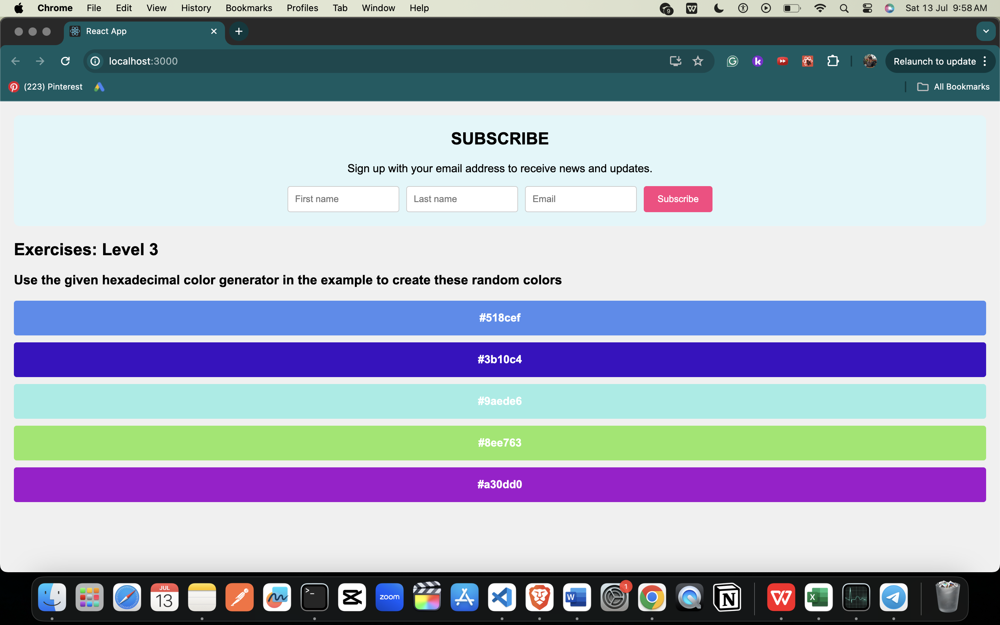

Day-4 Test



# 30 Days of React (30DoR)

### About

In this course, you'll learn about React components, JavaScript functions, classes, and how to create dynamic and reusable components.

### Login | Register

## Components

### What is a React Component?

- Small, reusable code responsible for part of the application UI.
- Can be either a functional or class-based component.

### Types of Components

- **Functional Components:** Also known as Presentational, Stateless, or Dumb Components.
- **Class Components:** Also known as Container, Stateful, or Smart Components.
- _Note:_ The classification above is outdated but good to know.

### Component Structure

- **Functional Component Example:**

```jsx
const Header = () => (
  <header style={headerStyles}>
    <div className="header-wrapper">
      <h1>Welcome to 30 Days Of React</h1>
      <h2>Getting Started React</h2>
      <h3>JavaScript Library</h3>
      <p>Yash Kalra</p>
      <small>July, 10 2024</small>
    </div>
  </header>
);
```

- **Class Component Example:**

```jsx
class Parent {
  constructor(firstName, lastName, country, title) {
    this.firstName = firstName;
    this.lastName = lastName;
    this.country = country;
    this.title = title;
  }
  getPersonInfo() {
    return `${this.firstName} ${this.lastName}, a ${this.title} developer based in ${this.country}`;
  }
}
```

### Rendering Components

```jsx
import React from "react";
import ReactDOM from "react-dom";

const Header = () => (
  <header>
    <div className="header-wrapper">
      <h1>Welcome to 30 Days Of React</h1>
      <h2>Getting Started React</h2>
      <h3>JavaScript Library</h3>
      <p>Yash Kalra</p>
      <small>Jult ,10 2024</small>
    </div>
  </header>
);

const rootElement = document.getElementById("root");
ReactDOM.render(<Header />, rootElement);
```

### Injecting Data into JSX

```jsx
const welcome = "Welcome to 30 Days Of React";
const title = "Getting Started React";
const subtitle = "JavaScript Library";
const firstName = "Yash";
const lastName = "Kalra";
const date = "Jult ,10 2024";

const Header = () => (
  <header>
    <div className="header-wrapper">
      <h1>{welcome}</h1>
      <h2>{title}</h2>
      <h3>{subtitle}</h3>
      <p>
        Instructor: {firstName} {lastName}
      </p>
      <small>Date: {date}</small>
    </div>
  </header>
);

const rootElement = document.getElementById("root");
ReactDOM.render(<Header />, rootElement);
```

### Creating Small Components

- **Button Component:**

```jsx
const Button = () => <button style={buttonStyles}>action</button>;
```

- **Hexadecimal Color Generator:**

```jsx
const hexaColor = () => {
  let str = "0123456789abcdef";
  let color = "";
  for (let i = 0; i < 6; i++) {
    let index = Math.floor(Math.random() * str.length);
    color += str[index];
  }
  return "#" + color;
};

const HexaColor = () => <div>{hexaColor()}</div>;

const rootElement = document.getElementById("root");
ReactDOM.render(<HexaColor />, rootElement);
```

## Exercises

### Level 1

1. What is the difference between a regular function and an arrow function?
2. What is a React Component?
3. How do you make a React functional component?
4. What is the difference between a pure JavaScript function and a functional component?
5. How small is a React component?
6. Can we make a button or input field component?
7. Make a reusable Button component.
8. Make a reusable InputField component.
9. Make a reusable alert box component.

### Level 2

1. Create functional components to display the given images.
2. Use functional components to create a newsletter design.

### Level 3

1. Use the hexadecimal color generator to create random colors.
2. Use functional components to design a user card.

Sure, here are the solutions for the tasks at each level:

### Level 1

1. **What is the difference between a regular function and an arrow function?**

   - Regular functions: Use the `function` keyword and have their own `this` context.
   - Arrow functions: Use the `=>` syntax and do not have their own `this` context; they inherit `this` from the surrounding scope.

2. **What is a React Component?**

   - A React component is a reusable piece of UI that can have its own state and props. It can be a class component or a functional component.

3. **How do you make a React functional component?**

   ```jsx
   function MyComponent() {
     return <div>Hello, World!</div>;
   }
   ```

4. **What is the difference between a pure JavaScript function and a functional component?**

   - A pure JavaScript function: Does not maintain any internal state or side effects and always produces the same output for the same input.
   - A functional component: Can maintain internal state (using hooks) and side effects (using lifecycle hooks like `useEffect`).

5. **How small is a React component?**

   - A React component can be as small as a single HTML element, like a button or input field, or more complex, encompassing multiple elements and child components.

6. **Can we make a button or input field component?**

   - Yes, React encourages creating small, reusable components, including buttons and input fields.

7. **Make a reusable Button component.**

   ```jsx
   function Button({ onClick, label }) {
     return <button onClick={onClick}>{label}</button>;
   }
   ```

8. **Make a reusable InputField component.**

   ```jsx
   function InputField({ type = "text", placeholder, value, onChange }) {
     return (
       <input
         type={type}
         placeholder={placeholder}
         value={value}
         onChange={onChange}
       />
     );
   }
   ```

9. **Make a reusable alert box component.**
   ```jsx
   function AlertBox({ message, type = "info" }) {
     const alertStyles = {
       padding: "1em",
       margin: "1em 0",
       borderRadius: "5px",
       backgroundColor:
         type === "info" ? "blue" : type === "warning" ? "yellow" : "red",
       color: "white",
     };
     return <div style={alertStyles}>{message}</div>;
   }
   ```

### Level 2

1. **Create functional components to display the given images.**

   ```jsx
   function ImageComponent({ src, alt }) {
     return (
       
     );
   }
   ```

2. **Use functional components to create a newsletter design.**
   ```jsx
   function Newsletter() {
     return (
       <div style={{ padding: "1em", border: "1px solid #ccc" }}>
         <h2>Newsletter</h2>
         <p>Subscribe to our newsletter to get the latest updates.</p>
         <InputField type="email" placeholder="Enter your email" />
         <Button label="Subscribe" onClick={() => alert("Subscribed!")} />
       </div>
     );
   }
   ```

### Level 3

1. **Use the hexadecimal color generator to create random colors.**

   ```jsx
   function getRandomColor() {
     const letters = "0123456789ABCDEF";
     let color = "#";
     for (let i = 0; i < 6; i++) {
       color += letters[Math.floor(Math.random() * 16)];
     }
     return color;
   }
   ```

2. **Use functional components to design a user card.**
   ```jsx
   function UserCard({ user }) {
     return (
       <div
         style={{
           border: "1px solid #ccc",
           padding: "1em",
           borderRadius: "5px",
         }}
       >
         
         <h3>{user.name}</h3>
         <p>{user.email}</p>
         <Button
           label="Contact"
           onClick={() => alert(`Contacting ${user.name}`)}
         />
       </div>
     );
   }
   ```

### Solutions

1. **What is the difference between a regular function and an arrow function?**

   - **Regular Function:** Declared using the `function` keyword. They have their own `this` context which can be dynamically scoped based on how the function is called.
   - **Arrow Function:** Declared using the `=>` syntax. They do not have their own `this` context but instead inherit `this` from the parent scope in which they are defined. They are also more concise and are often used for inline functions.

2. **What is a React Component?**

   - A React component is a reusable piece of the UI that can manage its own state and props. It can be defined as a JavaScript function or class, and it returns a React element that describes how a section of the UI should appear.

3. **How do you make a React functional component?**

   ```jsx
   const MyComponent = () => {
     return <div>Hello, World!</div>;
   };
   ```

4. **What is the difference between a pure JavaScript function and a functional component?**

   - **Pure JavaScript Function:** A function that takes inputs and returns outputs without any side effects. It always returns the same result for the same inputs.
   - **Functional Component:** A special type of JavaScript function used in React that returns a React element. It can manage internal state using hooks and can have side effects managed with lifecycle hooks like `useEffect`.

5. **How small is a React component?**

   - A React component can be as small as a single HTML element, like a button or input field, or it can be more complex, encompassing multiple elements and child components. The key is reusability and separation of concerns.

6. **Can we make a button or input field component?**

   - Yes, React encourages creating small, reusable components, including buttons and input fields.

7. **Make a reusable Button component.**

   ```jsx
   const buttonStyles = {
     padding: "10px 20px",
     background: "rgb(0, 255, 0)",
     border: "none",
     borderRadius: 5,
   };

   const Button = ({ label, onClick }) => (
     <button style={buttonStyles} onClick={onClick}>
       {label}
     </button>
   );
   ```

8. **Make a reusable InputField component.**

   ```jsx
   const InputField = ({ type = "text", placeholder, value, onChange }) => (
     <input
       type={type}
       placeholder={placeholder}
       value={value}
       onChange={onChange}
       style={{
         padding: "10px",
         borderRadius: "5px",
         border: "1px solid #ccc",
       }}
     />
   );
   ```

9. **Make a reusable alert box component with one div parent element and one p child element of the div (warning alert box, success alert box).**

   ```jsx
   const alertStyles = {
     base: {
       padding: "10px 20px",
       borderRadius: "5px",
       margin: "10px 0",
       color: "white",
     },
     warning: {
       backgroundColor: "orange",
     },
     success: {
       backgroundColor: "green",
     },
   };

   const AlertBox = ({ message, type = "warning" }) => {
     const style = {
       ...alertStyles.base,
       ...(type === "success" ? alertStyles.success : alertStyles.warning),
     };

     return (
       <div style={style}>
         <p>{message}</p>
       </div>
     );
   };
   ```

These solutions cover the key concepts and provide implementations for creating small, reusable components in React, demonstrating both the functionality and style customization capabilities of React components.
