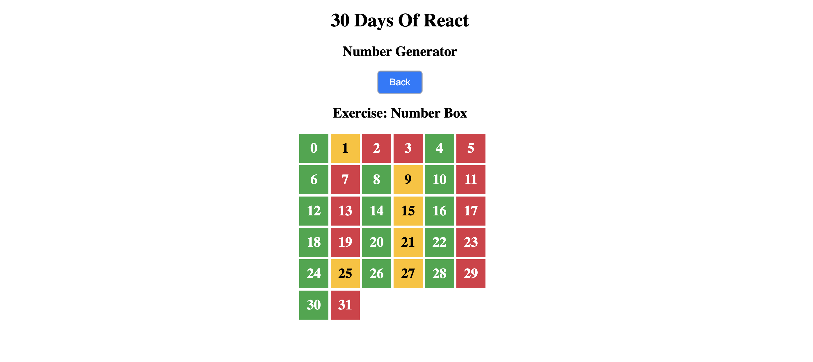

### 30 Days of React: Mapping Arrays
### Day6 Exercise
 
This README section covers the basics of mapping arrays in React, including examples and best practices.

---

## **Mapping Arrays in React**

Mapping arrays is a common technique in React for rendering lists of elements. It involves transforming an array into a list of JSX elements. This section will explore different use cases for mapping arrays, including arrays of numbers, strings, objects, and arrays of arrays.

### **Basic Concept**

To map an array to JSX elements, you use the `map()` method to transform each item in the array into a component or HTML element.

### **Examples**

#### **1. Mapping Array of Numbers**

*Initial Code:*

```jsx
import React from 'react'
import ReactDOM from 'react-dom'

const App = () => {
  return (
    <div className='container'>
      <div>
        <h1>Numbers List</h1>
        {[1, 2, 3, 4, 5]}
      </div>
    </div>
  )
}

const rootElement = document.getElementById('root')
ReactDOM.render(<App />, rootElement)
```

*Fixed Code:*

```jsx
import React from 'react'
import ReactDOM from 'react-dom'

const Numbers = ({ numbers }) => {
  const list = numbers.map((number) => <li key={number}>{number}</li>)
  return <ul>{list}</ul>
}

const App = () => {
  const numbers = [1, 2, 3, 4, 5]

  return (
    <div className='container'>
      <div>
        <h1>Numbers List</h1>
        <Numbers numbers={numbers} />
      </div>
    </div>
  )
}

const rootElement = document.getElementById('root')
ReactDOM.render(<App />, rootElement)
```

#### **2. Mapping Array of Arrays**

*Code:*

```jsx
import React from 'react'
import ReactDOM from 'react-dom'

const skills = [
  ['HTML', 10],
  ['CSS', 7],
  ['JavaScript', 9],
  ['React', 8],
]

const Skill = ({ skill: [tech, level] }) => (
  <li>
    {tech} {level}
  </li>
)

const Skills = ({ skills }) => {
  const skillsList = skills.map((skill) => <Skill key={skill[0]} skill={skill} />)
  return <ul>{skillsList}</ul>
}

const App = () => {
  return (
    <div className='container'>
      <div>
        <h1>Skills Level</h1>
        <Skills skills={skills} />
      </div>
    </div>
  )
}

const rootElement = document.getElementById('root')
ReactDOM.render(<App />, rootElement)
```

#### **3. Mapping Array of Objects**

*Code:*

```jsx
import React from 'react'
import ReactDOM from 'react-dom'

const countries = [
  { name: 'Finland', city: 'Helsinki' },
  { name: 'Sweden', city: 'Stockholm' },
  { name: 'Denmark', city: 'Copenhagen' },
  { name: 'Norway', city: 'Oslo' },
  { name: 'Iceland', city: 'Reykjavík' },
]

const Country = ({ country: { name, city } }) => (
  <div>
    <h1>{name}</h1>
    <small>{city}</small>
  </div>
)

const Countries = ({ countries }) => {
  const countryList = countries.map((country) => (
    <Country key={country.name} country={country} />
  ))
  return <div>{countryList}</div>
}

const App = () => (
  <div className='container'>
    <div>
      <h1>Countries List</h1>
      <Countries countries={countries} />
    </div>
  </div>
)

const rootElement = document.getElementById('root')
ReactDOM.render(<App />, rootElement)
```

### **Key Concepts**

- **Mapping Arrays**: Use the `map()` method to convert an array into a list of JSX elements. 
- **Using `key` Props**: Always provide a unique `key` prop to each element in the list for efficient re-rendering and to avoid React warnings.
- **Destructuring Props**: Destructuring props in function parameters makes the code cleaner and more readable.

### **Exercises**

1. **Why do you need to map an array?**
   - Mapping transforms arrays into lists of elements for rendering in React components.

2. **Why do we need keys during mapping an array?**
   - Keys help React identify which items have changed, are added, or are removed. They improve performance and prevent warnings.

3. **What is the importance of destructuring your code?**
   - Destructuring simplifies code by extracting values from arrays or objects into variables, making it cleaner and more readable.

4. **Does destructuring make your code clean and easy to read?**
   - Yes, destructuring improves code readability and reduces redundancy by accessing properties directly.

---


